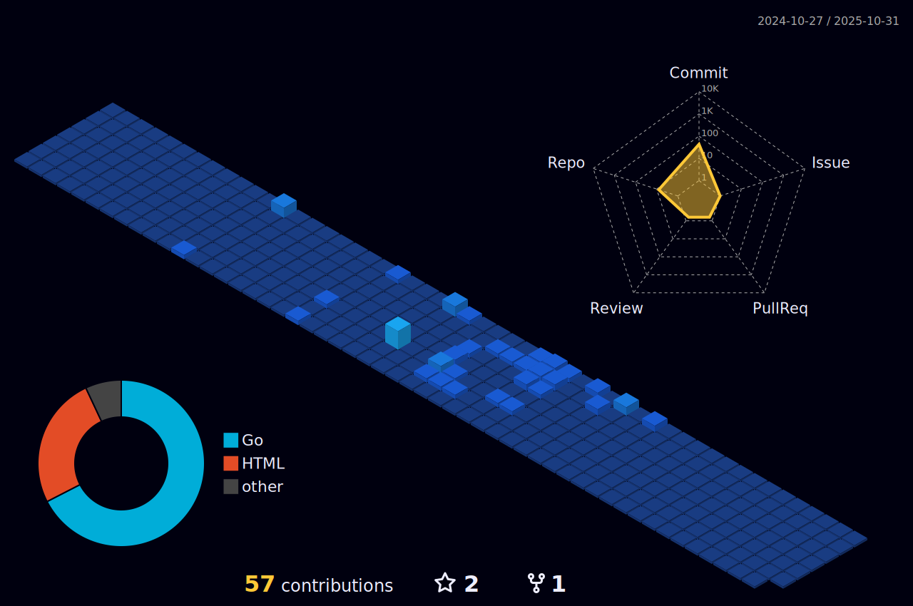

  
  <!-- dynamic typing effect 动态打字效果 -->
  

    
  

<!-- Snake Code Contribution Map 贪吃蛇代码贡献图 -->
<picture>
  <source media="(prefers-color-scheme: dark)" srcset="https://cdn.jsdelivr.net/gh/sun0225SUN/sun0225SUN/profile-snake-contrib/github-contribution-grid-snake-dark.svg" />
  <source media="(prefers-color-scheme: light)" srcset="https://cdn.jsdelivr.net/gh/sun0225SUN/sun0225SUN/profile-snake-contrib/github-contribution-grid-snake.svg" />
  
</picture>

<!-- About me 关于我 -->
## 🤺 About Me

 &nbsp;&nbsp;Nickname: jayvee  
&nbsp;&nbsp;&nbsp;&nbsp;School: Bilibili University  
&nbsp;&nbsp;&nbsp;&nbsp;&nbsp;&nbsp;Major: Master of Computer Technology  
&nbsp;&nbsp;&nbsp;Email: jvvcen@gmail.com
 

  <!-- -->

<!--
## 🏢 Intern Experience

- [网易] 📌 2023.05 —— 2023.09
  
  - 工作岗位：服务端开发工程师(intern)
  - 工作内容：大数据可视化分析平台
 

- [第三届字节跳动后端青训营] 📌 2022.05 —— 2022.07
  - 搜索引擎组 8th
  - [获奖证书](#)
 
 

 

- [北京智谱华章科技] 📌 2021.05 —— 2021.08
  
  - 工作岗位：Python 数据分析
  - 工作内容：AMiner学术科技情报大数据挖掘与服务系统

## 3D Contribution
<!-- profile-3d-contrib 3D贡献图-->

<!--  -->
-->

<!--💪 正在学习

  
🧠 计划学习

<!-- programming tool icon 编程工具图标
 

 

 
-->

 

<!--  -->

<!-- 
## Awards</strong>

- 2022第三届字节跳动后端青训营：8th 天马行空奖

## Recently
busy... -->

<!-- 
## Plans
- *[ ] 找实习 -->
<!-- - *[ ] [MIT 6.824](https://github.com/mooleetzi#mit-6824) -->
  

 

<!--
 

  

  

 

-->

 

[More Info](https://github.com/jwcen/)

